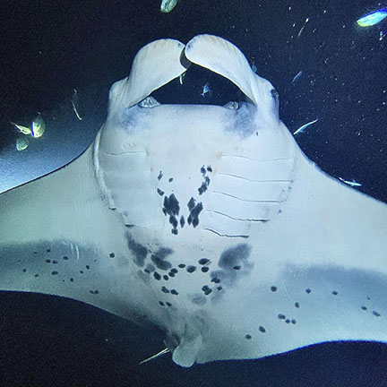
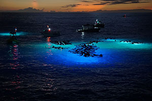
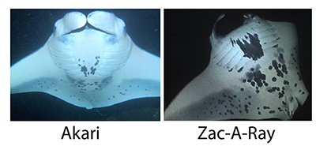
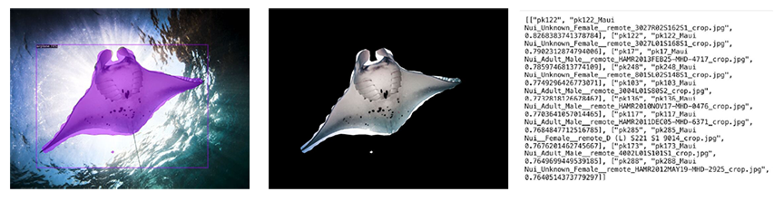

# Ikepono
## Low K-Shot Manta Ray Re-Identification

---

## Reidentifying Reef Manta (*M. alfredi*)

Every night, 300 or more snorkelers and SCUBA divers enter the waters of the Big Island with the hope of encountering the local population of manta rays. 

The global annual economic impact of manta ray tourism is significantly greater than $140M.1 

Understanding the dynamics of the local population is important for both science and industry. 

<small>
1. O'Malley MP, Lee-Brooks K, Medd HB. The global economic impact of manta ray watching tourism. PLoS One. 2013 May 31;8(5):e65051. doi: 10.1371/journal.pone.0065051. PMID: 23741450; PMCID: PMC3669133. https://pubmed.ncbi.nlm.nih.gov/23741450/ (And that was in 2013!)</small>

---

## ML for Re-identifying Mantas

Individual Reef Mantas (*M. alfredi*) have unigue markings. These markings stay consistent over the life of the ray. 

These markings can be used to identify individual mantas:

"Low K-Shot" learning allow mantas to be reidentified from as few as 5 reference photos. 

In our dataset of 99 individuals with more than 5 photos from the Kona, Big Island, population, even our quickly-trained model returns the correct manta with a Mean Reciprocal Rank of >0.8 (meaning that our first prediction is right at least 4 times as often as not). <small>(k >= 5, n = 99, MRR = .82; k >= 8, n = 55, MRR = 1.0)</small>

---

## Ikepono 
### "Lightning Eyes"

DEMO

---

# Hackathon Work

- UX
- Web application
- Deployment

v1 models developed 2023-2024 by L. O'Brien. v2 modeling began in Aug 2024. 

---

# Team 

(Alphabetical by last name?)

- Larry O'Brien : ML Models, System Architecture
- tk : tk 
- tk : tk 
- tk : tk 

---

## ML Pipeline

Our system is backed by a 3-model pipeline. 

1. The first model accepts a photograph and **detects** any manta rays in the image. 
    For each ray detected, we create an image cropped to the bounding box surrounding the manta
2. The second model works on each image produced by the first model. It **segments** the image and erases the background 
3. The third model takes the query images from the 2nd model and compares its **embedding** against reference embeddings stored in a vector database

# Model Details

Manta Detection: ResNet18 fine-tuned for mantas

Segmentation: SegmentAnything2 

Re-identification: 

- Custom-built with swappable backbones
- 128d embeddings trained using SubCenter ArcFaceLoss
- FAISS vector database

Open-source: MIT License
Source code: https://github.com/lobrien/ikepono
Weights: Available directly from lobrien@knowing.net (HuggingFace soon)
---
# Longer-term goals

Validation from MPRF on Kona population
Apply to Maui population
Outreach to researchers in other populations

Permanent hosting

"Bring Your Own Species" Generality for Population Biologists

- Cetaceans
- Sea Turtles
- Zebras 

---
# Acknowledgements

Training data courtesy of:

    - Manta Pacific Research Foundation
    - Mark Deakos

Additional photography from: Bo Pardau, Jeff Molder, Jeff Milisen

Special thanks to: Keller Laros, Janice McLaughlin, Mark Deakos

